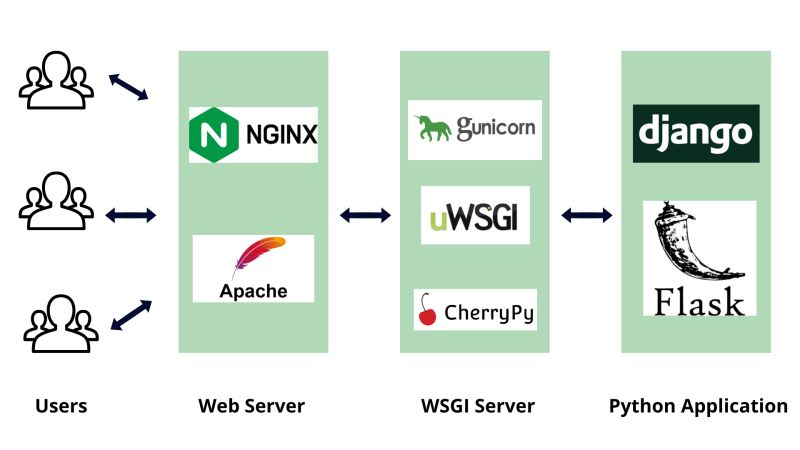
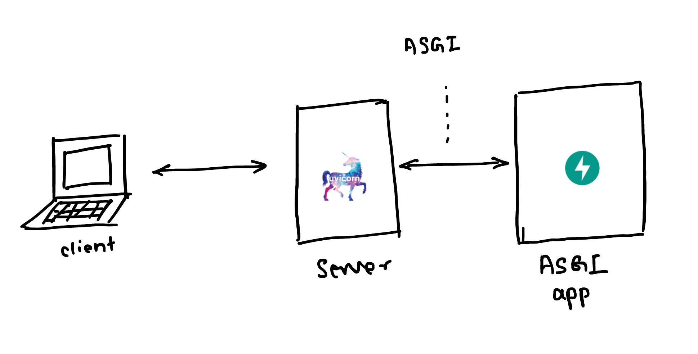

# HTTP/REST

Для написания REST API на Python существуют специальные фреймворки, упрощающие написание
 API

Самые популярные фреймворки:
- FastAPI
- Django
- Flask

Сегодня мы рассмотрим более низкоуровневые темы:
- aiohttp
- uvicorn
- starlette

