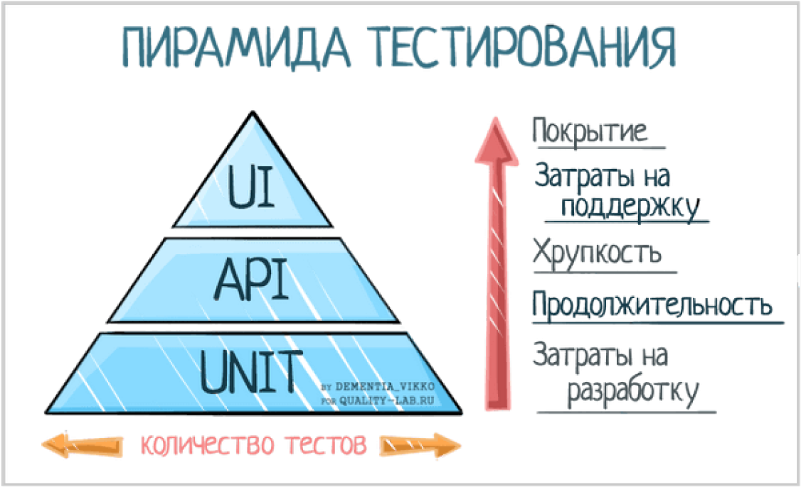

# Тестирование

Основные этапы тестирования:

- **unit-tests** - тестирование конкретных компонент сервиса, функций, классов, логики и т.п.
- **integration tests** - тестирование микросервисов и их взаимодействия
- **e2e** - более масштабное тестирование различных пользовательских сценариев

Основные библиотеки для написания тестов на python - `unittest` и `pytest`.

### Pytest

На практике мы рассмотрим:

- формат и правила написания тестов
- маркеры
- работа с фикстурами
- мокирование
- интеграционные тесты
- плагины