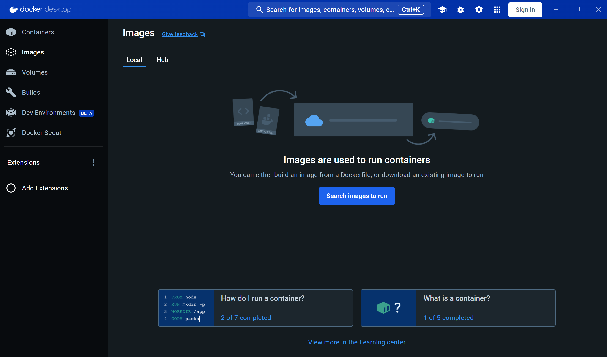

# Docker

Docker — программное обеспечение, которое позволяет работать с контейнерами.

Docker имеет клиент-серверную архитектуру. 

Основный компоненты Docker Engine:

- *docker client* - программа на клиенте, через которую пользователь взаимодействует с Docker хостом посредством Docker API

- *docker daemon (dockerd)* - фоновый процесс, который обрабатывает запросы от клиента и сообщает нужные инструкции в docker runtimes (containerd and runc)

- *docker-containerd* — высокоуровневая среда запуска контейнеров (high-level runtime). Она собирает все необходимые для контейнера образы, распаковывает их, а затем передаёт их в runc.

- *docker-runc* — низкоуровневая среда запуска контейнеров (low-level runtime). Она отвечает за непосредственный запуск контейнеров, выделением необходимых ресурсов, и отслеживаением жизненного цикла.

### Установка

Установить Docker можно с официального сайта: https://docs.docker.com/desktop/

Для Windows и Mac сам движок докера идёт только в комплекте Docker Descktop - десктопное приложение, которое предоставляет UI для работы.



Установку можно проверить командой:
```shell
docker --version
```

### Создание контейнера

Давайте запустим первый контейнер. Для начала в терминале выполним следующую команду:
```shell
docker pull docker/welcome-to-docker:latest
```
Команда `docker pull` загружает docker-образ из удалённого реестра контейнеров (по умолчанию Docker Hub) 
на локальную машину.

Посмотрим информацию о скачанных docker-образах:
```shell
docker image ls
```

Запустим контейнер на основе загруженного образа:
```shell
docker run -d --name first-container -p 8080:80 docker/welcome-to-docker:latest
```
- `-d` используется для запуска в фоновом режиме (чтобы консоль не заблокировалась выводом логов контейнера).
- `--name` используется для указания имени контейнера (иначе будет назван случайно).
- `-p` связывает порт хоста с портом контейнера

Посмотрим детальную информацию об образе:
```shell
docker image inspect docker/welcome-to-docker:latest
```

Посмотрим запущенные контейнеры:
```shell
docker ps
```

В колонке PORTS можно увидеть ```0.0.0.0:8080->80/tcp```. 
Это означает, что запросы, пришедшие на порт 8080 хоста будут
перенаправлены на порт 80 контейнера.
Можно перейти на http://localhost:8080 чтобы убедиться.

Посмотрим размер контейнера:
```shell
docker ps -s 
```
В колонке SIZE можно увидеть что-то вроде `1.09kB (virtual 14.1MB)`.
- `81.9kB` - это по сути размер самого контейнера
- `16.6MB` - это его размер с учётом файлов из образа

Как видите, использование слоистой структуры образов позволяет сильно экономить память за
 счёт монтирования, а не копирования, файлов из базовых слоёв.

Посмотрим подрробную информацию о контейнере:
```shell
docker image inspect docker/welcome-to-docker:latest
```

Остановим контейнер и удалим его одной командой:
```shell
docker rm -f first-container
```