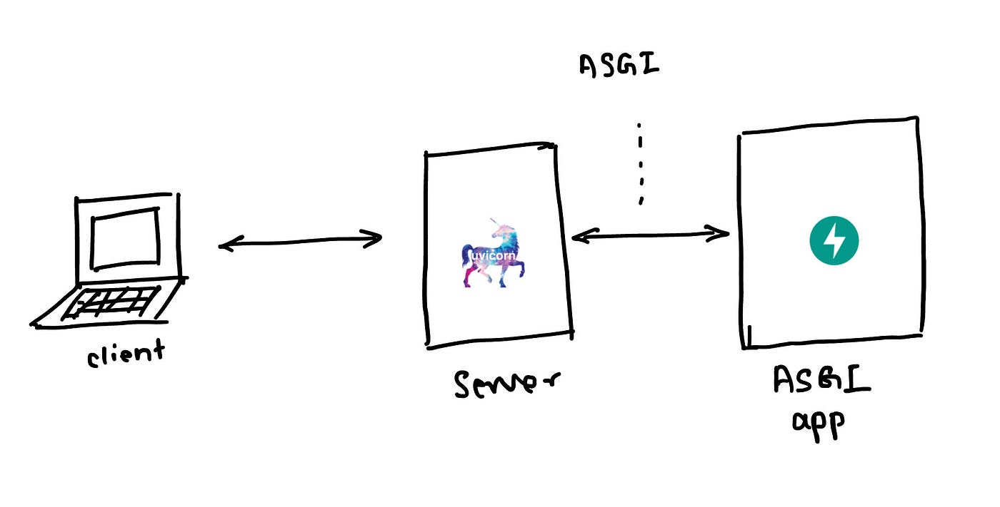
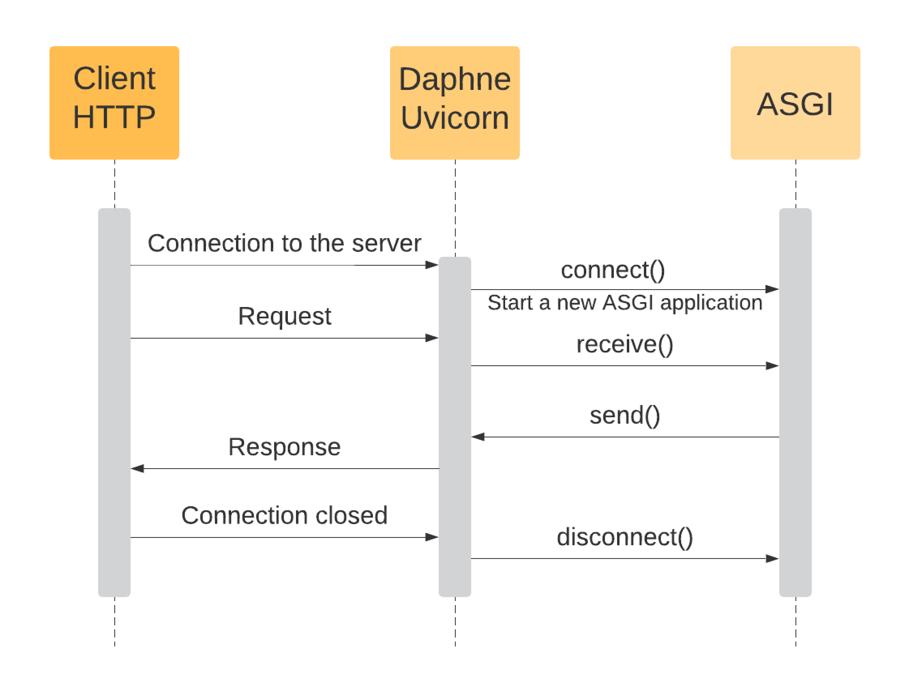

## Интеграционное тестирование

Интеграционные тесты нужны, чтобы проверить работы сервиса в целом.
 В таких тестах обычно тестируются эндпоинты сервиса.

Чтобы протестировать сервис, в тест нужно передать его клиента, через которого мы 
будем отправлять запросы. Рассмотрим примеры клиентов.


### AsyncClient

AsyncClient — это асинхронный HTTP‑клиент, который позволяет 
вызывать эндпоинты сервиса так, как их вызывал бы реальный клиент, при этом
 позволяя делать это асинхронно.

#### Обработка запроса сервисом

ASGI‑сервер и ASGI‑приложение — это разные компоненты: сервер принимает соединения/запросы из сети и передаёт их в приложение по контракту ASGI.





Из этого можно сделать вывод, что мы можем отправлять запросы в сервис двумя способами:
- сразу в наше приложение используя ASGI интерфейс, в этом случае объект приложения можно создать в том же процессе, в котором запускаются тесты
- более реально, по сети на сервер, однако при этом должен быть запущен инстанс сервиса в отдельном процессе.

Через `AsyncClient` первый способ можно реализовать так:
```python
from app.main import app

@pytest.fixture
async def simple_async_client():
    async with httpx.AsyncClient(
        transport=httpx.ASGITransport(app=app),
        base_url="http://test",
    ) as ac:
        yield ac
```
- параметр `transport` как раз отвечает за то, каким образом отправлять запросы
- `base_url` - приставка для удобства, чтобы не указывать полный `url` запроса при каждом вызове

```python
async def test_health(simple_async_client):
    response = await simple_async_client.get("/health")
    assert response.status_code == 200
```

Пример клиента с отдельно запущенным сервисом:
```python
@pytest.fixture
async def real_service_async_client():
    async with httpx.AsyncClient(
        transport=httpx.AsyncHTTPTransport(),
        base_url="http://127.0.0.1:8000",
    ) as ac:
        yield ac
```

В таком случае клиент должен быть предварительно запущен (например, в контейнере) и доступен на `http://127.0.0.1:8000`.

Такие тесты являются более надёжными, так как тестируют сервис в black-box режиме.

В первом случае необходимо мокать работы со третьим сервисам, во втором случае необходимо, 
чтобы третьи сервисы было доступны для сервиса.